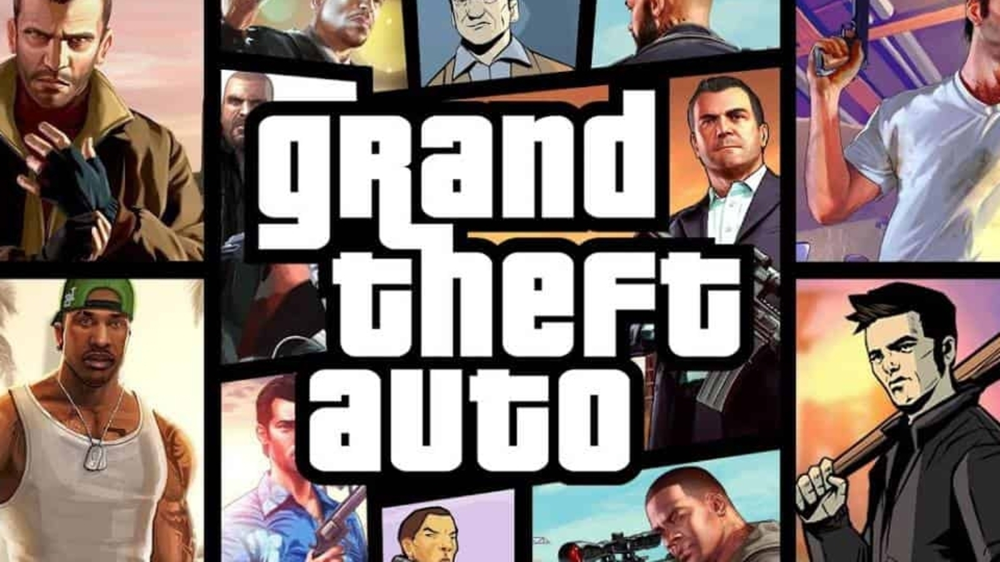
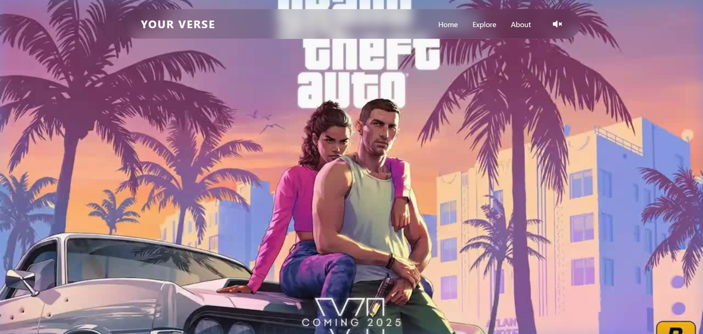
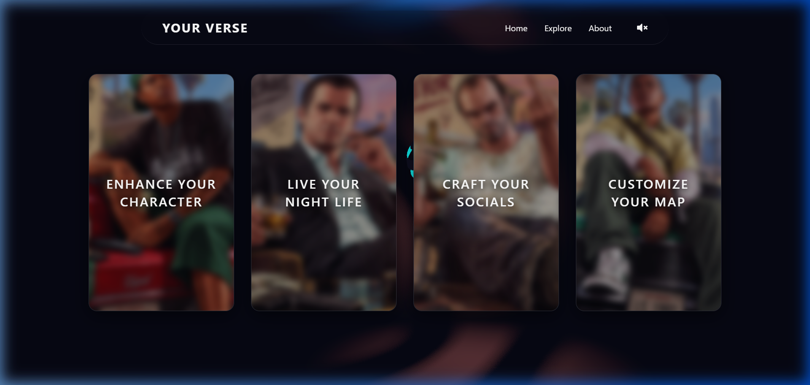
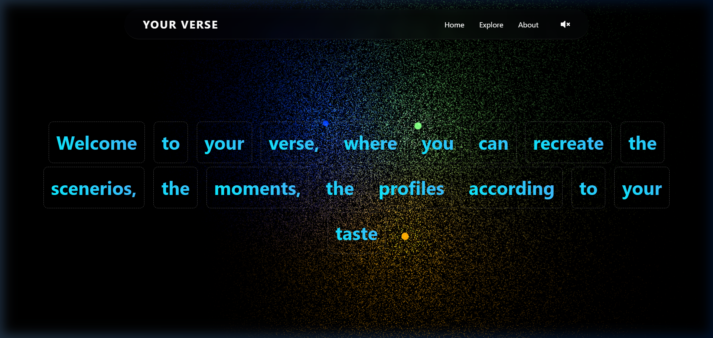

<p align="center">
  
</p>

<h1 align="center">🎮 GTA — Your Verse</h1>

<p align="center">
  <em>Customize your world in GTA. Your story. Your rules. Your verse.</em>
</p>

<p align="center">
  <a href="https://github.com/pratyush06-aec/gta_your_verse/stargazers"></a>
  <a href="https://github.com/pratyush06-aec/gta_your_verse/network/members"></a>
  <a href="https://github.com/pratyush06-aec/gta_your_verse/issues"></a>
  <a href="https://github.com/pratyush06-aec/gta_your_verse/blob/main/LICENSE"></a>
</p>

---

## 📋 Table of Contents

- [About the Project](#-about-the-project)
- [Demo](#-demo)
- [Screenshots](#-screenshots)
- [Tech Stack](#-tech-stack)
- [Project Structure](#-project-structure)
- [Getting Started](#-getting-started)
  - [Prerequisites](#prerequisites)
  - [Installation](#installation)
  - [Running the Development Server](#running-the-development-server)
  - [Building for Production](#building-for-production)
- [Architecture & Components](#-architecture--components)
- [Image Editor Integration](#-image-editor-integration)
- [Scroll Sequence System](#-scroll-sequence-system)
- [Contributing](#-contributing)
- [License](#-license)
- [Contact](#-contact)

---

## 🎯 About the Project

**GTA — Your Verse** is an immersive, GTA-themed web experience built with React and powered by cutting-edge web technologies like Three.js WebGPU, GSAP animations, and an integrated image editor. It allows users to explore the GTA universe and customize their own GTA-themed content — characters, nightlife posters, social media cards, and maps — all from within the browser.

### ✨ Key Features

- **🎬 Cinematic Scroll Sequences** — A scroll-driven frame-by-frame animation system that plays out cinematic GTA sequences as the user scrolls, synchronized with animated text overlays.
- **🃏 Interactive Explore Cards** — Four themed experience cards (Character, Nightlife, Socials, Map) that expand with GSAP Flip transitions to reveal a full image editor.
- **🖼️ Integrated Image Editor** — Powered by [`@unlayer/react-image-editor`](https://github.com/nicekiwi/react-image-editor), each card opens with a tailored set of editing tools (crop, filter, draw, text, stickers, frames, shapes) and a custom sidebar for live configuration.
- **🌌 WebGPU Particle Universe** — The About page features a real-time Three.js WebGPU scene with 500,000 interactive particles illuminated by orbiting point lights.
- **🎵 Ambient Background Music** — Persistent audio playback across all routes with a global mute/unmute toggle.
- **🔍 Full-Screen Preview & Download** — After editing, users can preview their creation in a full-screen overlay and download it as a PNG.
- **💎 Glassmorphic UI** — A cohesive dark glassmorphism design language with frosted-glass navbars, overlays, and controls.

---

## 🎬 Demo

<video src="assets/project_clip.mp4" controls="controls" width="100%"></video>

<p align="center">
  <em>👆 Watch the full project clip, or download <a href="https://github.com/pratyush06-aec/gta_your_verse/raw/main/assets/project_clip.mp4"><code>assets/project_clip.mp4</code></a> directly.</em>
</p>

---

## 📸 Screenshots

### 🏠 Landing Page — Cinematic Scroll Sequence
The landing page features a scroll-driven cinematic experience with 900+ frame-by-frame images across 4 sequences, synchronized with animated text phrases.

<p align="center">
  
</p>

### 🃏 Explore Page — Interactive Cards
Four GTA-themed experience cards with GSAP Flip transitions. Click any card to expand it and launch the integrated image editor.

<p align="center">
  
</p>

### 🌌 About Page — WebGPU Particle Universe
An interactive Three.js WebGPU scene with 500,000 particles lit by three orbiting colored point lights, with GSAP-animated text overlay.

<p align="center">
  
</p>

---

## 🛠️ Tech Stack

| Category | Technology |
|---|---|
| **Framework** | [React 18](https://react.dev/) |
| **Build Tool** | [Vite 4](https://vitejs.dev/) |
| **3D Rendering** | [Three.js (WebGPU)](https://threejs.org/) |
| **Animations** | [GSAP 3](https://gsap.com/) + [SplitType](https://github.com/lukePeavey/SplitType) |
| **Image Editor** | [@unlayer/react-image-editor](https://www.npmjs.com/package/@unlayer/react-image-editor) |
| **Routing** | [React Router v7](https://reactrouter.com/) |
| **Icons** | [React Icons](https://react-icons.github.io/react-icons/) |
| **Styling** | Vanilla CSS (Glassmorphism) |

---

## 📁 Project Structure

```
gta_your_verse/
├── assets/                      # Static assets (character images, maps, audio, project clip)
│   ├── Franklin.png             # Franklin character card background
│   ├── Lamar.png                # Lamar character image & editor seed
│   ├── Michael.png              # Michael card background
│   ├── Trevor.png               # Trevor card background & socials seed
│   ├── map.jpg                  # Map editor seed image
│   ├── night_life.jpg           # Nightlife editor seed image
│   ├── gta_fav_icon.jpg         # Project favicon / logo
│   └── project_clip.mp4         # Full project demo video
│
├── public/
│   └── assets/                  # Scroll sequence frame images
│       ├── gta_landing/         # Landing sequence (231 frames)
│       ├── bar/                 # Bar sequence (240 frames)
│       ├── gym/                 # Gym sequence (240 frames)
│       └── strip_club/          # Strip club sequence (240 frames)
│
├── screenshots/                 # README screenshots
│   ├── landing_page.png
│   ├── explore_cards.png
│   └── about_page.png
│
├── src/
│   ├── main.jsx                 # React entry point
│   ├── App.jsx                  # Root component (routing, audio state, layout)
│   ├── index.css                # Global styles (glassmorphism, editor sidebar, overlays)
│   └── components/
│       ├── Navbar.jsx           # Glassmorphic floating navbar with music toggle
│       ├── ScrollSequence.jsx   # Scroll-driven cinematic frame player
│       ├── Explore.jsx          # Interactive cards + image editor integration
│       ├── EditorSidebar.jsx    # Custom editor sidebar (tools, theme, locale, dock)
│       ├── About.jsx            # WebGPU particle universe + animated headline
│       ├── About.css            # About page specific styles
│       └── Footer.jsx           # Footer with social links (LinkedIn, Twitter, GitHub)
│
├── index.html                   # HTML entry point
├── vite.config.js               # Vite configuration
├── package.json                 # Dependencies and scripts
├── videoplayback.weba            # Background music audio file
└── README.md                    # This file
```

---

## 🚀 Getting Started

### Prerequisites

Before you begin, ensure you have the following installed on your machine:

| Tool | Version | Installation |
|---|---|---|
| **Node.js** | `v18.0.0` or higher | [Download Node.js](https://nodejs.org/) |
| **npm** | `v9.0.0` or higher | Comes bundled with Node.js |
| **Git** | Latest | [Download Git](https://git-scm.com/) |
| **Modern Browser** | Chrome 113+ / Edge 113+ | Required for WebGPU support |

> ⚠️ **WebGPU Requirement**: The About page uses Three.js WebGPU renderer. Make sure your browser supports WebGPU. Check at [webgpu.io](https://webgpu.io).

### Installation

1. **Clone the repository**

   ```bash
   git clone https://github.com/pratyush06-aec/gta_your_verse.git
   ```

2. **Navigate into the project directory**

   ```bash
   cd gta_your_verse
   ```

3. **Install dependencies**

   ```bash
   npm install
   ```

   This will install all the required packages listed in `package.json`, including React, Three.js, GSAP, the Unlayer Image Editor, and other dependencies.

### Running the Development Server

Start the Vite development server with hot module replacement:

```bash
npm run dev
```

The application will be available at:

```
http://localhost:5173/
```

> 💡 **Tip**: Vite provides instant hot module replacement (HMR), so any changes you make to the source code will be reflected in the browser immediately without a full page reload.

### Building for Production

To create an optimized production build:

```bash
npm run build
```

This will generate a `dist/` folder with the compiled and minified assets.

### Previewing the Production Build

To preview the production build locally:

```bash
npm run preview
```

---

## 🏗️ Architecture & Components

### Application Flow

```
App.jsx (Root)
├── <BrowserRouter>
│   ├── <Navbar />              — Glassmorphic floating nav (auto-hides on card expand)
│   ├── <Routes>
│   │   ├── "/" → <ScrollSequence />     — Cinematic scroll-driven frame player
│   │   ├── "/explore" → <Explore />     — Interactive cards + image editor
│   │   └── "/about" → <About />         — WebGPU particle universe
│   └── <Footer />              — Social links (only visible on "/" route)
└── <audio>                     — Persistent background music player
```

### Component Breakdown

#### `ScrollSequence.jsx`
The landing page hero. Renders a full-viewport `<canvas>` and preloads 951 frame images across 4 cinematic sequences (`gta_landing`, `bar`, `gym`, `strip_club`). As the user scrolls, the corresponding frame is drawn to the canvas using `object-fit: cover` logic. A synchronized GSAP master timeline animates text phrases (split into characters via SplitType) in and out based on scroll progress.

#### `Explore.jsx`
The core interactive experience. Features:
- **3D WebGPU Background**: A Three.js scene with orbiting colored cubes and orbit controls.
- **GSAP Flip Cards**: Four GTA-themed cards that expand to full-screen with Flip layout transitions.
- **Image Editor Mount**: On card expansion, the `@unlayer/react-image-editor` is mounted with the card's seed image.
- **EditorSidebar Integration**: A custom sidebar sits side-by-side with the editor inside a flexbox container.
- **Maximize/Minimize**: The editor can be toggled to true fullscreen mode.
- **Preview & Download**: After saving, a glassmorphic overlay shows the final image with a download button.

#### `EditorSidebar.jsx`
A custom React component extracted and adapted from the [`react-image-editor` demo](https://github.com/nicekiwi/react-image-editor). Provides live controls for:
- **Actions**: Reset to seed image, upload a custom image.
- **Options**: Toggle between Light/Dark themes and switch locales (EN, ES, FR, DE, JA).
- **Dock**: Move the editor's internal toolbar between left and right positions.
- **Tools**: Checkbox grid to dynamically enable/disable editor tools (Crop, Resize, Filter, Draw, Text, Shapes, Stickers, Frame).

#### `About.jsx`
An immersive WebGPU particle cloud scene. Creates 500,000 random 3D points illuminated by three orbiting point lights (amber, blue, green) using a custom `LightingModel`. Features OrbitControls for interactive camera rotation and GSAP-animated headline text.

#### `Navbar.jsx`
A floating, glassmorphic navigation bar centered at the top of the viewport. Contains route links (Home, Explore, About) and a music toggle button. Auto-hides when a card is expanded in the Explore page via a custom `footer-visible` event.

#### `Footer.jsx`
Route-conditional footer (only renders on `/`). Includes social media links (LinkedIn, Twitter, GitHub) and uses IntersectionObserver to trigger navbar hide/show behavior.

---

## 🖼️ Image Editor Integration

The image editor is powered by `@unlayer/react-image-editor` and is deeply integrated into the Explore page cards.

### Per-Card Tool Presets

Each card initializes the editor with a curated set of tools tailored to its theme:

| Card | Enabled Tools | Typical Use Cases |
|---|---|---|
| **🧑 Character** | Crop, Filter, Text, Draw, Stickers, Frame | Crop portrait, adjust colors, add alias, tattoo-style drawing |
| **🌃 Nightlife** | Crop, Filter, Text, Shapes, Stickers, Frame | Neon color grade, event title, date/time, club branding |
| **📱 Socials** | Crop, Filter, Text, Stickers, Frame | Instagram-style composition, caption, location overlay |
| **🗺️ Map** | Crop, Draw, Text, Shapes, Stickers | Draw route, add markers, destinations, labels |

### Editor Workflow

```
1. Click a card → GSAP Flip expands it to full-screen
2. Editor mounts with the card's seed image + tool preset
3. Use the sidebar to tweak theme, locale, dock position, and toggle tools
4. Upload a custom image to override the seed (or Reset to revert)
5. Click "Maximize" (⛶) to go true fullscreen
6. Use the editor's built-in "Save" button
7. Preview the result in a glassmorphic overlay
8. Download the final image as PNG
```

---

## 🎬 Scroll Sequence System

The scroll sequence system is the backbone of the landing page experience. It plays cinematic GTA scenes frame-by-frame as the user scrolls.

### How It Works

1. **Frame Storage**: 951 JPEG frames are stored in `public/assets/` across 4 subdirectories, named `ezgif-frame-001.jpg` through `ezgif-frame-{N}.jpg`.
2. **Preloading**: On mount, all frames are preloaded as `Image()` objects into an array cache.
3. **Scroll Mapping**: A `scroll` event listener maps `scrollFraction` (0–1) to the global frame index.
4. **Canvas Rendering**: The matched frame is drawn to a fullscreen `<canvas>` using cover-fit math.
5. **Text Sync**: A GSAP master timeline with 9 phrase sub-timelines is scrubbed to the same scroll fraction.

### Adding New Sequences

To add a new scroll sequence:

1. Extract your video into numbered JPEG frames using a tool like [ezgif.com](https://ezgif.com/video-to-jpg).
2. Place the frames in `public/assets/<sequence_name>/` with the naming pattern `ezgif-frame-001.jpg`.
3. Add the sequence to the `sequences` array in `ScrollSequence.jsx`:

   ```js
   const sequences = [
     // ... existing sequences
     { name: 'your_new_sequence', frames: 240 },
   ];
   ```

---

## 🤝 Contributing

Contributions are welcome! Here's how you can get started:

1. **Fork** the repository
2. **Create** a feature branch:
   ```bash
   git checkout -b feature/your-feature-name
   ```
3. **Commit** your changes:
   ```bash
   git commit -m "Add: your feature description"
   ```
4. **Push** to the branch:
   ```bash
   git push origin feature/your-feature-name
   ```
5. **Open** a Pull Request

### Development Guidelines

- Follow the existing code style and component patterns.
- Use vanilla CSS for styling — no CSS frameworks unless discussed.
- Test on a WebGPU-capable browser (Chrome 113+).
- Keep the glassmorphic design language consistent.
- Add comments for complex logic (especially Three.js/GSAP code).

---

## 📄 License

This project is open source and available under the [MIT License](LICENSE).

---

## 📬 Contact

**Pratyush Dutta** — Creator & Developer

<p>
  <a href="https://www.linkedin.com/in/pratyush-dutta-221b94302/" target="_blank"></a>
  <a href="https://x.com/pd_0406official" target="_blank"></a>
  <a href="https://github.com/pratyush06-aec" target="_blank"></a>
</p>

---

<p align="center">
  <strong>⭐ If you found this project interesting, consider giving it a star! ⭐</strong>
</p>

<p align="center">
  Made with ❤️ and a whole lot of GTA vibes
</p>
